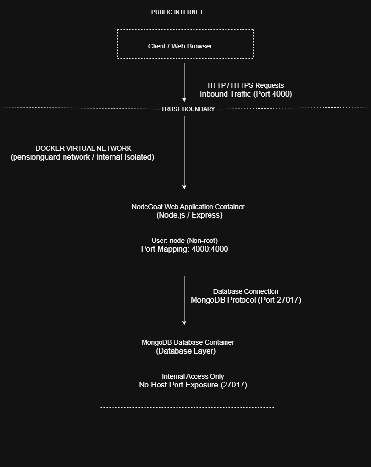

# PensionGuard - System Architecture
# Date: 2026-09-07
# Created by: Member 1

## Application Overview
- **Name:** OWASP NodeGoat
- **Working Title:** PensionGuard
- **Purpose:** Retirement savings management platform
- **Tech Stack:** Node.js, Express, MongoDB

---

## Components

### 1. User Browser
- **Role:** Client-side interface for users
- **Communication:** HTTP/HTTPS
- **Interaction:** Login, view data, submit forms

### 2. Web Application (NodeGoat Web)
- **Technology:** Node.js with Express framework
- **Port:** 4000 (exposed to host)
- **Purpose:** Serve web interface, handle user requests, business logic
- **Key Files:** `routes/`, `models/`, `controllers/`
- **Security:** Runs as non-root user

### 3. Database (MongoDB)
- **Technology:** MongoDB 4.4
- **Port:** 27017 (internal, not exposed to host)
- **Purpose:** Store user data, profiles, allocations, contributions
- **Key Collections:** users, profiles, allocations, contributions

---

## Trust Boundaries

### Boundary 1: Internet → Internal Network
- **Separation:** User browser vs application server
- **Security Controls:** HTTPS, session management, authentication
- **What crosses:** HTTP requests (login, profile, allocations)
- **Risk:** User input can be malicious

### Boundary 2: Application → Database
- **Separation:** Web app vs database server
- **Security Controls:** Database authentication, query sanitization
- **What crosses:** MongoDB queries (find, update, insert)
- **Risk:** Query injection (NoSQL injection)

---

## Data Flows

| Source | Target | Data Type | Protocol | Port |
|--------|--------|-----------|----------|------|
| Browser | Web App | Login credentials, profile data, allocations | HTTP | 4000 |
| Web App | Browser | HTML pages, JSON responses | HTTP | 4000 |
| Web App | Database | Queries (find, update, insert) | MongoDB | 27017 |
| Database | Web App | User data, allocations, profiles | MongoDB | 27017 |

---

## Network Configuration

| Service | Container Name | Host Port | Container Port |
|---------|---------------|-----------|----------------|
| Web Application | web | 4000 | 4000 |
| Database | mongo | (none - internal) | 27017 |

---

## Architecture Diagram

*Figure 1: PensionGuard System Architecture showing components, trust boundaries, and data flows*

---

## Security Considerations

| # | Consideration | Why It Matters |
|---|---------------|----------------|
| 1 | MongoDB is NOT exposed to the host | Only accessible internally - reduces attack surface |
| 2 | Web app port 4000 is the only entry point | Single point of control |
| 3 | All user input crosses Trust Boundary 1 | Must be validated before processing |
| 4 | All database queries cross Trust Boundary 2 | Must be sanitized to prevent injection |
| 5 | Web app runs as non-root user | Limits damage if container is compromised |

---

## Summary

**PensionGuard** consists of three main components:
1. **User Browser** - Client interface
2. **NodeGoat Web Application** - Business logic (Node.js/Express, Port 4000)
3. **MongoDB Database** - Data storage (Port 27017, internal)

**Two Trust Boundaries exist:**
1. Internet → Internal Network (user input validation)
2. Application → Database (query sanitization)

**Data flows in both directions** between all components, requiring security controls at each boundary.

## Container Hardening Summary
| Control | Status |
|---------|--------|
| Non-root user | ✅ Applied |
| Minimal image | ✅ Applied |
| Database internal | ✅ Applied |
| Resource limits | ✅ Applied |